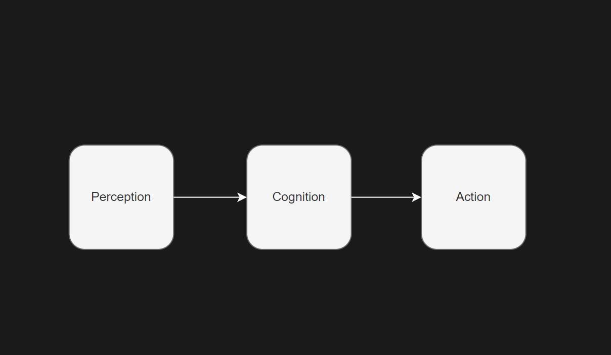
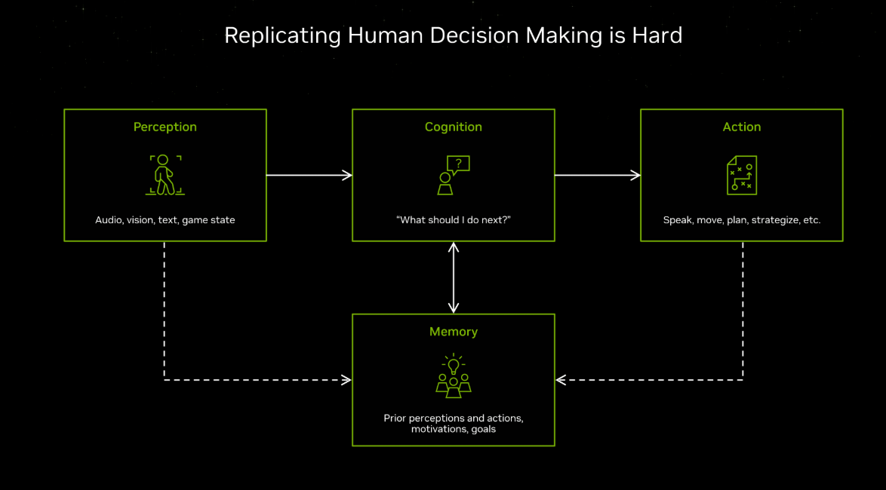
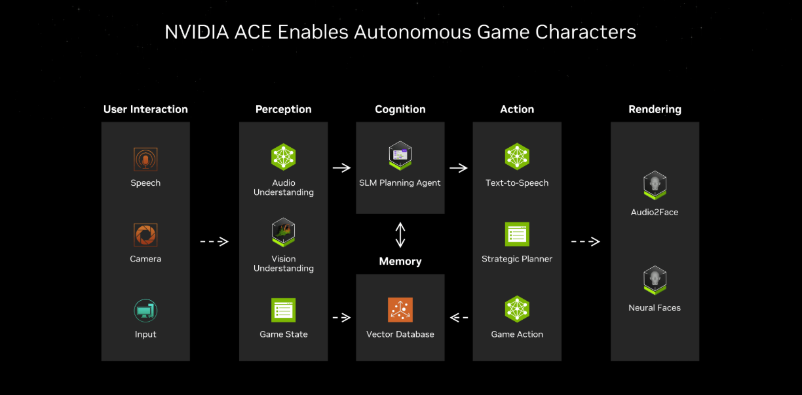

# AI模型

我理解的AI经典模型是感知->认知->行为模型：

**感知**：获取外界信息
**认知**：大脑，对外界信息进行处理，涉及到复杂概念，Resoning, Planning，Memory等
**行为**：根据认知做出的反应
游戏AI中也是用的这种经典模型。

***nvidia-ace***

***nvidia-ace***

## Reference
[NVIDIA Redefines Game AI With ACE Autonomous Game Characters](https://www.nvidia.com/en-us/geforce/news/nvidia-ace-autonomous-ai-companions-pubg-naraka-bladepoint/)