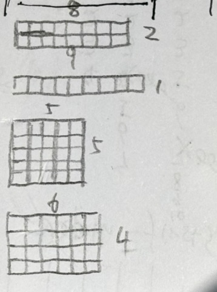

# 最大化行李箱容积问题

> 如果航空公司设置行李箱体积规则，宽高必须相等，设为x, 长宽高相加起来最大等于45，那么行李箱最大容积为多少?

我们逐步推算：

---

### 1️⃣ 条件

设行李箱的长宽高分别为

* 长：( L )
* 宽：( W )
* 高：( H )

题目说“宽高必须相等”，所以
$W = H = x$

并且“长宽高相加最大等于45”，所以
$
L + W + H = 45
$

代入 ( W = H = x ) 得
$
L + 2x = 45
$
→
$
L = 45 - 2x
$

---

### 2️⃣ 容积公式

体积:
   $$ V = L \times W \times H = L \times x \times x = Lx^2 $$

代入 ( $L = 45 - 2x$ )，得：
$
V = (45 - 2x)x^2 = 45x^2 - 2x^3
$

---

### 3️⃣ 求最大值

对 ( V(x) ) 求导：
$
V'(x) = 90x - 6x^2 = 6x(15 - x)
$

令 ( $V'(x) = 0$ )，得：
$
x = 0 \quad \text{或} \quad x = 15
$

显然 ( x=0 ) 无意义，取 ( x=15 )。

---

### 4️⃣ 对应长度与体积

$
L = 45 - 2(15) = 15
$
于是 ( L = W = H = 15 )，即行李箱是**正方体**。

体积为：
$
V = 15^3 = 3375
$

---

✅ **答案：**
最大容积为 **3375 立方单位**（例如立方英寸或立方厘米，取决于单位）。

## 从常识或其他理论的的角度解释为什么是正方体是最优化

非常好的问题。这个问题其实不仅是数学题，也涉及到**几何、物理、工程**甚至**经济学**中的一个普遍规律：

> 在给定“边界”或“约束”条件下，形状越均衡（各方向越相等），体积或效率越高。

我们可以从多个角度来解释为什么「正方体」在这种约束下最优：

---

### 🧮 一、从数学对称性角度

假设一个箱子的体积为
$
V = LWH
$
约束是
$
L + W + H = \text{定值}
$

这其实是一个经典的优化问题，使用拉格朗日乘子法求解，可以得出：
$
L = W = H
$

也就是说，只要体积是三个方向长度的乘积、而约束是三个方向长度的线性和，那么**最优值必然出现在三个方向完全相等时**。
这是因为：

* 体积函数对每个维度是对称的；
* 任何不均衡（比如一个边变长，另一个边变短）都会导致乘积下降。

换句话说，**在和一定的条件下，乘积在“各数相等”时最大**。
这就是 AM-GM（算术平均数-几何平均数不等式）的直接应用：
$$
\frac{L+W+H}{3} \ge (LWH)^{1/3}
$$
等号成立当且仅当 ( L=W=H )。

---

### ⚙️ 二、从几何和物理“均衡性”角度

如果把“长宽高”看作箱子的三个方向的“资源分配”，

* 当三者相等时，资源分配最平衡；
* 当某一维太长，另外两维太短时，体积会因为“短板效应”而下降。

类似的道理：

* 一个球体在**表面积一定时**体积最大；
* 一个正方体在**长宽高和一定时**体积最大。

这是几何中非常普遍的“对称最优原理”：约束对称 → 最优解也对称。

---

### 📦 三、从现实工程的角度

工程设计中也常有类似的优化逻辑：

* 若要用**最少材料**（或限定边长和）获得**最大容量**，就倾向于设计成各方向均衡的形状；
* 比如储罐、气球、气泡、肥皂泡——自然界中都会趋向“各方向压力一致”的状态，形成球或近似立方体；
* 因为非对称会造成某个方向“利用率不高”，相当于浪费边长或材料。

---

### 💡 四、直觉解释

想象我们要用 45 cm 的“边长总和”做一个箱子：

* 如果做成长条形，比如 ( L=40, W=H=2.5 )，虽然总长相同，但体积变成 ( 40×2.5×2.5=250 )，非常小；
* 如果均分三边 ( 15+15+15=45 )，体积 ( $15^3=3375$ )，明显更大。

这是因为“乘积最大”来自“平衡”：

> 一个很大一个很小相乘，远小于多个接近的数相乘。

---

### ✳️ 小结

| 角度      | 原理                | 结论             |
| ------- | ----------------- | -------------- |
| 数学对称性   | AM-GM 不等式 / 拉格朗日法 | 各方向相等时体积最大     |
| 几何对称性   | 对称约束 → 对称最优       | 正方体最优          |
| 物理/自然类比 | 压力平衡 → 最小能量状态     | 自然趋向均衡形状       |
| 直觉/经验   | “短板效应”            | 长宽高越接近，空间利用率越高 |

---

总结一句话：

> 在给定“总长度”或“边和”的情况下，行李箱变成正方体是体积最大的最优方案，因为对称、均衡的分配能让每个方向都充分“参与”到体积增长中。

## 继续解释
> 因为非对称会造成某个方向“利用率不高”，相当于浪费边长或材料。

非常好，这句话其实可以更深入地解释成一种**“资源分配效率”**或**“几何乘积效应”**的原理。我们来拆解一下为什么「非对称」意味着“浪费边长或材料”。

---

### 🧩 一、数学本质：乘积的“平衡效应”

体积公式是
$
V = L \times W \times H
$

而约束是
$
L + W + H = \text{固定值}
$

这个关系的关键点在于——
**“和”是线性关系，而“积”是非线性关系”**。

假设你有一笔“资源”45，要分配给三个变量：

* 若平均分配：(15, 15, 15)，乘积为 (3375)。
* 若不均分：(30, 10, 5)，虽然总和还是45，但乘积变成 (30×10×5=1500)。

👉 同样的“资源总量”，越平均分配，乘积越大。

这是算术平均数-几何平均数（AM-GM）定理的具体体现：
$
\frac{L+W+H}{3} \ge (LWH)^{1/3}
$
等号成立当且仅当 (L=W=H)。

所以数学上，“非对称”分配意味着有一部分“潜力”没有被充分利用——就像“某个方向太长，另两个方向太短”，导致总体乘积下降。

---

### ⚙️ 二、几何直觉：边长长短不一会“浪费空间”

想象你拿一张 45 cm 长的铁丝，弯成一个长方体框架。

* 如果三条边都相等（正方体），框架“体积最大”；
* 如果你把其中一条拉得特别长，另外两条短很多，那么三维空间中的“体积扩张”效果变差了。

为什么？因为体积增长依赖于**三维方向的乘积**。
如果一个维度小，体积增长就“被卡住”了——这就是“短板效应”。

举个形象比喻：

> 你可以把体积想成“面积 × 高度”。
> 如果底面（长×宽）很小，即使高度再高，总体积也有限；
> 反过来，如果底面很大但高度很矮，也一样浪费了底面积。
> 只有三者接近平衡时，每一维的“贡献”都最大化。

---

### 🧱 三、物理意义：压力与能量的均衡

自然界中，类似的最优结构也常常出现在：

* 气泡趋向于成为球体；
* 液滴、细胞趋向于球形；
* 晶体趋向于立方结构。

这是因为当表面积或周长固定时，**均衡的形状可以在最小“表面积损耗”下包住最大体积**，即能量最小、效率最高。

从能量角度看，非对称形状的某些方向“拉得太长”，相当于：

* 增加了维持结构所需的表面积；
* 却没有换来成比例的体积增长；
* 所以“浪费了材料”。

---

### 💡 四、现实比喻：资源利用率

把「长宽高」想成「时间、人力、资金」三种资源。

* 如果你把所有预算都砸在“时间”上（超长周期），而人手和资金不足，项目效率会非常低；
* 如果三者平均分配，协同效率最高。

这就是几何问题背后的普遍规律：

> **在乘积型目标下，资源的均衡分配比偏向单一维度更高效。**

---

### ✅ 总结一句话：

非对称的箱子浪费了体积潜力，因为体积依赖的是**三个方向的乘积**，而不是加和。
当某个方向过长、其他方向过短时，乘积被“短的那边”限制住了。
而正方体让三个方向都参与到体积扩张中，没有任何方向被“闲置”或“拉长浪费”，
因此实现了**资源的最高利用率**。

---

