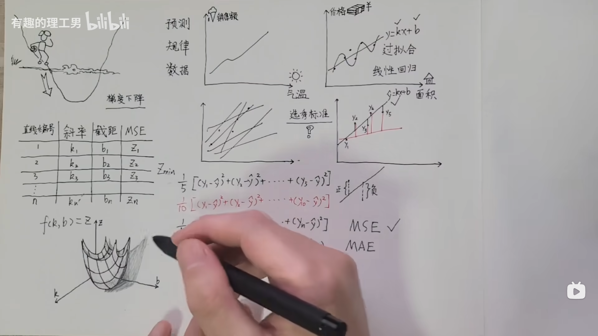
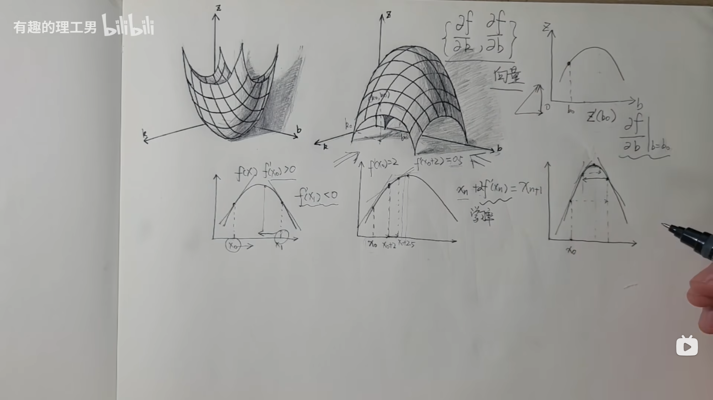

# 线性回归

线性回归是一种基础监督学习算法，机器学习最基础的学习算法之一。

一般最基础的使用**损失函数**和**梯度下降算法**

下面给老太太讲什么是线性回归。

---

## 📖 什么是线性回归？

想象你有个小孙子，每天吃多少饭（米饭的重量）和他的体重有关系。你记录了他这几天吃饭和体重的情况，想找出**吃饭量和体重之间的关系**。

我们可以画个图，横着是「吃饭量」，竖着是「体重」，然后在图上把这些天的记录点点画出来。

**线性回归**就是：
👉 找一条**直线**，大致穿过这些点，表示吃饭量和体重的关系。

---

## 📖 为什么要用「损失函数」MSE？

你肯定想问：“我随便画条线也行啊，为什么还要计算什么损失？”

因为：

* 有的直线画得好，离这些点点都很近；
* 有的直线画得差，离点点很远。

我们需要一个办法来**衡量每条线画得好不好**。

👉 损失函数就是用来「算一算这条线画得好不好」的。

### 📌 什么是 MSE？

MSE 全名叫**均方误差（Mean Squared Error）**，别怕名字，意思就是：

1. 每个点到这条直线的“竖直距离”，算一下是多少（叫误差）；
2. 把这些距离平方（不管是正是负，都变成正数）；
3. 再把所有平方值加起来，算个平均数。

👉 数字越小，说明这条线画得越好。

就好比你每天织毛衣，看看针脚是不是整齐，越整齐，分数越高。

---

## 📖 为什么用「梯度下降法」来找最好的线？

你现在知道要找条线，得让 MSE 尽量小。

问题是，可能有无数条线，怎么找呢？总不能把所有线都画一遍，比一比吧，太累了。

👉 所以我们用「梯度下降法」来帮忙。

### 📌 什么是梯度下降法？

假设你现在站在山上（代表 MSE 很高），你想找到山谷里最低的那个点（代表 MSE 最小，也就是最佳的那条线）。

你怎么办？

* 每次顺着最陡的方向走几步（这叫求梯度，就是看看哪边坡最陡）；
* 一直走到坡度不再变，到了最低处。

这就叫「梯度下降法」。

---

## 📖 总结给老太太听 🌸

* **线性回归**是找一条直线，描述「吃多少饭和体重」之间的关系。
* \*\*损失函数（MSE）\*\*是量尺，看看你画的这条线和所有点点距离有多大，越小越好。
* **梯度下降法**是帮你找到最好的那条线，不用乱试，顺着最陡的坡，一步步走到最低处。

就像做饭：

* 你要调味（线性回归）；
* 尝一口看看咸淡（损失函数）；
* 一点点加盐（梯度下降法），直到刚刚好。

---

## 梯度下降算法是怎么回事
我们把上面的函数写作
**Z=kX+b**
Z是关于k,b的二元函数，可以画作：

[B站-有趣的理工男](https://www.bilibili.com/video/BV19f421Q7CL/?spm_id_from=333.337.search-card.all.click&vd_source=9f4e814662b4f1f152382d2489347ba9)

通过分别对二元函数求b和k的偏导，得到**梯度向量{df/dk, df/db}**， 当梯度为0时的k,b就是最小损失函数值时的，线性回归的k，b值

## Reference
[B站-有趣的理工男](https://www.bilibili.com/video/BV19f421Q7CL/?spm_id_from=333.337.search-card.all.click&vd_source=9f4e814662b4f1f152382d2489347ba9)

