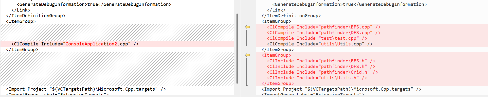

---
tag:
  - AI_GEN
  - WIP

---

# VSCode手动构建C++项目

## C++项目构建简介

- cmake
- make
- ninja
- 集成开发环境（VisualStudio）
- vscode

## 预编译Include配置

TODO

<!-- 这是一个注释，不会在渲染后的页面中显示  -->


## Link配置

TODO

## 题外（For Unreal Engine user），Unreal Engine 构建 
- UBT
- 基于Module构建
- 填写Public Include和Private Include. Public Include相当于提供了Module的API。
- 模块文件夹下的所有cpp文件自动递归扫描全部加入编译

### Q: 为什么要手动填写Include，而cpp文件自动全部添加编译

因为cpp的编译机制决定的
- 在 C++ 中，每个 .cpp 是一个独立的编译单元（translation unit），它不需要被别人包含，只要被编译器拿来处理就行。
 - 全部丢给编译器，编成 .obj，然后统一链接成 .dll、.exe、.lib 等目标文件。
- 头文件不是独立的编译单元
 - 一种“文字级代码注入机制”：被包含到其他 .cpp 中去，参与语法/符号解析。

###  特性决定了不能自动 include：

* C++ 的 `#include` 是**预处理阶段**的操作，**不是构建系统能全自动决定的行为**；
* 如果构建系统强制把所有头文件都 `#include`，你会面临：

  * 巨大编译开销（所有符号暴露）
  * 名字冲突、重复定义、顺序依赖灾难
  * 模块耦合度上升，编译边界模糊

---

### C++ 头文件采用“显式包含”的设计原因：

| 原因       | 说明              |
| -------- | --------------- |
| ✅ 避免冗余   | 只 include 你用到的头 |
| ✅ 控制依赖边界 | 你知道自己用了哪些外部符号   |
| ✅ 编译速度快  | 减少不必要的预处理量      |
| ✅ 保持模块清晰 | 不污染命名空间，不传播内部实现 |

---

### 那为什么 Unreal 可以让模块自动暴露 include 路径？

虽然不能自动 include 内容，但 UBT 做了很聪明的事情：

> ✅ **它会自动把模块中的 `Public/` 目录加入 include path**
> ✅ **你只需 `#include "MyHeader.h"`，编译器就能找到它**

比如：

```
Source/
├── MyModule/
│   ├── Public/
│   │   └── MyStruct.h
│   ├── Private/
│       └── MyActor.cpp
```

在其他模块里你只需：

```cpp
#include "MyStruct.h" // 不需要写路径
```

背后其实是 UBT 添加了 `-IYourModule/Public` 到 include 路径中。


