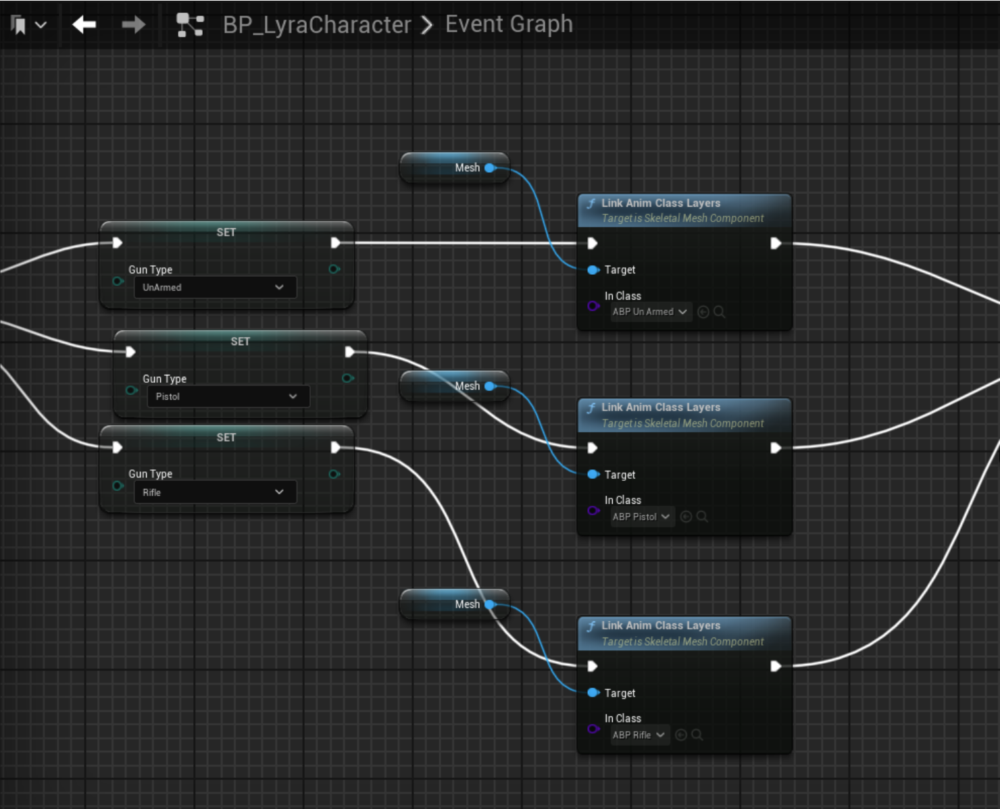

---
tag:
  - stars

---

# 博客test

## Idle Animations

一共有三种方式

-   State machine，通过transition切换 （transition带有blend animation）
-   BlendPoses (with int or with Enums)

    -   switch select by value 来选择动画
-   use dynamic sequence with onUpdate data binding to update sequence to play. and use inerialization to blend with sequences.

## Linked animations

使用多态的思想，利用Animation Layer Interface实现多态




``` c++
// code sample
print(hello)
print(hello)
```

我们把上面的函数写作
$$
Z=kx+b
$$
这是行内公式：$E = mc^2$。


