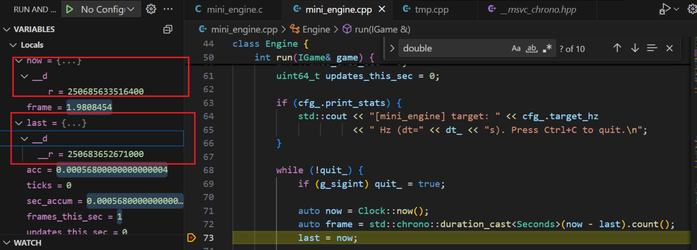

# C++时钟

Q:C++时钟的精度如何，提供时钟的原理是什么？
---

TLDR：
C++ chrono 能提供 ns 级别的稳定计时，是因为计算机硬件中有**晶体振荡器(Crystal Oscillator)** 提供 **ppm(parts per million(百万分之一))** 稳定度的基准频率，硬件计数器以这个频率递增。现代 CPU 可通过固定频率或倍频生成高频计数源，通过计数周期数并结合频率换算，得到高分辨率的时间值。steady_clock 使用这种硬件计数器来保证单调和高分辨率，但它的 ns 只是表示精细的刻度，不代表与真实物理秒的绝对偏差为 0。

Q:std::chrono::steady_clock是什么
---
`std::chrono::steady_clock` 是 C++ 标准库 `<chrono>` 里的一种**时钟类型**，用来提供**单调递增**（steady）的时间点测量。

### 核心特点

1. **单调递增**

   * 不会因为系统时间的修改而倒退或跳变。
   * 适合测量两个时间点之间的**持续时间**。
   * 即使用户手动调整系统时钟，或 NTP 同步系统时间，也不会影响它的计时结果。

2. **固定的时间间隔**

   * `steady_clock::now()` 返回的时间间隔是稳定的，不会因为 CPU 频率调整而不精确。
   * 用于性能测量或超时检测时，结果可预测。

3. **不可与系统时间直接对应**

   * 它返回的 `time_point` 没有直接的“现实时间”意义，不能用来表示具体的日期或时间戳。
   * 更像是一个“内部秒表”，只保证相对间隔可靠。

---

### 常见用途

* 测量函数运行耗时：

  ```cpp
  #include <iostream>
  #include <chrono>
  #include <thread>

  int main() {
      auto start = std::chrono::steady_clock::now();
      
      std::this_thread::sleep_for(std::chrono::seconds(2)); // 模拟耗时操作
      
      auto end = std::chrono::steady_clock::now();
      auto duration = std::chrono::duration_cast<std::chrono::milliseconds>(end - start);
      
      std::cout << "耗时: " << duration.count() << " 毫秒\n";
  }
  ```

  即使在运行中修改系统时间，结果也不会受影响。

---

### 和其他时钟的对比

| 时钟类型                    | 是否单调递增 | 是否受系统时间调整影响 | 用途                |
| ----------------------- | ------ | ----------- | ----------------- |
| `system_clock`          | ❌      | ✅           | 获取当前的日历时间（现实世界时间） |
| `steady_clock`          | ✅      | ❌           | 精准测量时间间隔（计时器）     |
| `high_resolution_clock` | 实现相关   | 实现相关        | 提供最高精度的计时，但不一定稳定  |

> **注意**：在多数实现中，`high_resolution_clock` 可能只是 `steady_clock` 或 `system_clock` 的别名。

Q:用词上为什么选择chrono和steady？
---
这两个名字其实是有深思熟虑的命名设计，不是随便拍脑袋取的。

## 1. 为什么叫 **`chrono`**

* **词源**：来自希腊语 **χρόνος (khrónos)**，意思是**时间**。
* 在很多西方技术术语中，`chrono` 是“与时间有关”的通用前缀，比如：

  * chronology（年代学）
  * chronometer（精密计时器）
  * synchronous/asynchronous（同步/异步，词根同源）

C++ 标准库作者选 `chrono` 做命名空间名，是因为它非常直观：

* 见到 `<chrono>` → 立刻联想到“时间处理”
* 避免用 `time` 这种太常见的名字（会和 `<ctime>`、平台 API 名字冲突）

> 换句话说，`chrono` 是为了既**语义清晰**又**不与旧 API 混淆**。

---

## 2. 为什么叫 **`steady_clock`**

* **steady**：英语里有“稳定的、持续的、不间断的”意思
* 在计时领域，steady clock 就是指**单调递增、不受外部干扰的时钟**。

  * 不会倒退
  * 不会跳变
  * 走时速度稳定（恒定 tick rate）

在标准里，`steady_clock` 的语义就是：

> 一个 **monotonic clock**（单调时钟），测量时间间隔时结果不受系统时间调整影响。

相比之下：

* `system_clock`：代表真实世界的挂钟时间（会被用户/NTP调整）
* `steady_clock`：代表一个稳定、不跳变的计时基准

---

## 3. 命名背后的风格

C++ 标准库的命名哲学：

1. **用真实领域的术语**（chrono 来自时间学，steady 是计时领域常用形容词）
2. **保证语义直观**（一看就知道是干什么的）
3. **避免缩写和模糊命名**（不叫 sc 或 s\_clock 这种）

---

## 4. 补充

如果你查 POSIX / Linux API，会发现类似的名字：

* `CLOCK_MONOTONIC`（Linux monotonic clock）≈ C++ `steady_clock`
* `CLOCK_REALTIME`（Linux 实时时钟）≈ C++ `system_clock`

C++ 标准库作者实际上是**在跨平台封装这些底层时钟**，并且取了更面向程序员的名字。

Q:steady clock精度如何，实现原理是什么
---
下面把你关心的两个点分开讲：**精度（precision/分辨率）到底有多高**、**底层是怎么实现的**。顺手也区分下常被混用的术语：resolution、accuracy、stability。

## 精度到底多高？

先澄清三个概念：

* **Resolution（分辨率）**：时钟“最小刻度”，也就是你能观察到的最小步进；对应 `std::chrono::steady_clock::period`。
* **Accuracy（准确度）**：读数离真实时间间隔的误差。
* **Stability/Monotonicity（稳定/单调）**：不会倒退；步进速率基本恒定，不受系统时间调表影响。

标准只**保证单调（`is_steady == true`）**，并不规定分辨率是多少；分辨率是**实现相关**的。但在现代平台通常非常细：

* **Linux**：通常是纳秒分辨率（`period = 1ns`），实际可观测精度常在几十纳秒到微秒量级（取决于硬件与内核时序源）。
* **Windows**（`QueryPerformanceCounter`）：典型频率 3–30+ MHz（对应分辨率 \~0.3µs 到 \~30ns），多数现代机型达到 \~0.1µs 甚至更细。
* **macOS**（`mach_absolute_time`）：纳秒刻度，实际精度通常在几十纳秒到微秒量级。

> 小结：分辨率常见是**纳秒级接口 + 微秒级有效精度**。测应用侧耗时、帧间 Δt、超时等都绰绰有余。

你可以在代码里查看本机分辨率：

```cpp
#include <chrono>
#include <ratio>
#include <iostream>
int main() {
  using C = std::chrono::steady_clock;
  std::cout << std::boolalpha << "is_steady=" << C::is_steady << "\n";
  std::cout << "period = " 
            << (double)C::period::num / C::period::den << " seconds per tick\n";
}
```

如果打印出 `1e-9` 左右，就是纳秒刻度。

## 底层实现原理（跨平台概览）

`steady_clock` 是标准库对**操作系统“单调时钟”**的封装。不同系统的路线不同，但思想类似：**读一个不会倒退的高频计数器**，用**比例因子**把“tick 数”转换成时间。

* **Linux**：`CLOCK_MONOTONIC`（有时是 `MONOTONIC_COARSE`/`MONOTONIC_RAW`）

  * 内核选择一个**time source**（常见：Invariant TSC、HPET、ACPI PM Timer）。
  * 通过 vDSO 在用户态快速读取，避免系统调用开销。
  * **NTP/chrony 校时**时会“**slew**（微调速率）”而非跳变，保证单调不回拨；`MONOTONIC_RAW` 则基本不做校正。
* **Windows**：`QueryPerformanceCounter`（QPC）

  * 老系统可能落到 HPET/PMT，现代系统通常用**Invariant TSC**，并做跨核同步与频率稳定性保证。
  * 提供高频率计数器 + 频率值（`QueryPerformanceFrequency`）用于换算。
* **macOS**：`mach_absolute_time`

  * 读取硬件计数器，配合 `mach_timebase_info` 的分子/分母进行单位换算。
  * 同样保证单调、不受“挂钟时间”调整影响。

这些实现会处理几个历史痛点：

* **跨核 TSC 不同步**：现代 CPU/OS 会做校准或干脆选用 invariant TSC；
* **节能/变频影响**：选择**与频率无关**的计数源，或做缩放校正；
* **校时跳变**：对“系统时间”执行 **slew** 而不是 step，或采用 raw 源。

## 为什么“steady”还能被校时？

“steady”指**单调**，不是“完全不被任何算法影响”。像 Linux 的 `CLOCK_MONOTONIC` 可能因 NTP 采用 ppm 级速率微调（slew，例如 ±500 ppm），**但不会回拨**，也不会突然跳跃。因此测量两个事件的**相对间隔**仍可靠。若你需要“绝对原始的硬件计数”可选 raw（C++ 没直接暴露 raw，但很多实现会让 `steady_clock` 接近 raw 的行为）。

## 实战建议（尤其做引擎/游戏）

* **帧间 Δt**、**性能采样**、**超时控制** → 统一用 `steady_clock`。
* 取 Δt 用 `duration<double>`（秒为单位）最通用：

  ```cpp
  using Clock = std::chrono::steady_clock;
  auto t0 = Clock::now();
  // ... work ...
  auto dt = std::chrono::duration<double>(Clock::now() - t0).count(); // seconds
  ```
* **避免把 `system_clock` 做差**：系统时间可能被 NTP/用户调整。
* **批量调用开销**：一次帧里别在热路径重复读很多次时钟；读一次传递 Δt 更高效。
* **长时运行漂移**：对物理仿真可做 clamping（例如限制 0.001s–0.05s）来稳住仿真步长。
* **跨平台一致性**：不要硬编码假设“分辨率一定是 1ns”；以 `period` 为准；在统计里做鲁棒性处理（去极值/中位数）。

## 一句话总结

`std::chrono::steady_clock` 在现代平台通常提供**纳秒级分辨率、微秒级有效精度**，底层通过**单调硬件计数器 + 比例换算**实现，并通过**slew** 等机制保证不因系统时间调整而回拨。用它测**时间间隔**是跨平台、类型安全且足够精确的最佳实践。

Q:为什么内核刻度可以做到精确的对应到真实世界的1ns或几ns,没有一点偏差？
---
先给结论：**内核/标准库里“纳秒（ns）”是“数值单位/分辨率”，不是对“真实秒”的绝对精准承诺**。
操作系统能返回以 ns 表示的时间，是因为做了**比例换算**；但**频率误差、温度漂移、量化与舍入**等都会带来偏差。换句话说：API 可以给你“到纳秒的读数”，但它不是“绝对没有一点误差的纳秒”。

## 为什么看起来能到 ns？

底层都有个“单调计数器”（TSC/HPET/PMT/mach counter）。内核维护比例系数，把“计数器 tick”换算成 ns：

```
delta_cycles = cycles_now - cycles_base
ns = ns_base + ((delta_cycles * mult) >> shift)   // 整数定点换算
```

* `freq` 是计数器实际频率（例如 3.2 GHz、14.318 MHz）。
* `mult ≈ 1e9 * 2^shift / freq`。
* 表面上你得到“纳秒级”的整数结果，但这是**数学映射**，不是“硬件真的每 1ns 跳一次”。

## 误差从哪来？

1. **频率误差（ppm 级）**
   晶振都会偏（温度、老化、电压）。10–50 ppm 很常见：

   * 50 ppm ⇒ 每秒误差 50 微秒；1 小时累计 \~0.18 s。
     OS 会估计并校准，但**不会变成零**。

2. **校时/驯服（slew/discipline）**
   NTP/chrony/PTP 会把“频率偏差”调成更接近 1 秒=1e9 ns，方法是**微调走时速率**（±几百 ppm），确保**单调不回拨**（steady），但仍是**近似**。

3. **量化与舍入**

   * 计数器本身的步进不一定是 1ns（比如 HPET \~70ns 一跳，PMT \~279ns）。
   * 定点换算会有舍入误差（通常做成长期零均值，但瞬时有 ±1ns 量级抖动）。

4. **跨核/节能影响**
   现代 CPU 提供 **Invariant TSC** 并做跨核同步，但历史/某些平台仍可能有极小相位差，需要内核校正。

5. **读取抖动**
   读计数器本身也要几到几十纳秒，路径不同（系统调用 vs vDSO/用户态）会带来**读数噪声**。

## 现实能有多准？

* **不对时**：靠本机晶振，误差常见 10–50 ppm。
* **NTP（公网）**：一般 1–10 ms 量级对 UTC 的准确度。
* **NTP/chrony（良好局域网）**：几十到几百微秒。
* **PTP（IEEE 1588）+ 网卡硬件时间戳**：亚微秒到十几纳秒（数据中心典型做法）。
* **GPSDO（1PPS 驯服本地振荡器）**：可把本机频率拉到 10⁻¹¹ 量级，做到“对真秒”的纳秒级，但这需要专用硬件与时钟树设计，不是普通 PC。

## 和 `steady_clock` 的关系

`steady_clock` 只承诺**单调**和**相对间隔稳定**（非常适合测耗时、Δt、超时）。
它**不**承诺“对真实世界的秒绝对无偏差”。数字显示“ns”≠ 物理意义上的“无误差纳秒”。

## TL;DR

* “ns”是**分辨率与表示**，不是“绝对准确度”。
* OS 通过**计数器 + 定点比例换算 +（可选）对时驯服**提供时间。
* 任何通用平台都会有**ppm 级频率误差与量化误差**；可以被 NTP/PTP 等**显著减小**，但不会神奇地变成“没有一点偏差”。
* 做游戏/引擎的**时间差**测量用 `steady_clock` 已经非常可靠；若你要和 UTC 贴到亚微秒/纳秒，得上 **PTP/GPSDO/硬件时间戳**这类专用方案。


Q:什么是Hz。典型频率 3–30+ MHz为什么对应到分辨率 ~0.3µs 到 ~30ns
---
简短说法：**Hz（赫兹）= 每秒的“次数/周期数”**。频率 $f$ 和单次周期时长（周期、刻度） $T$ 的关系是

$$
T=\frac{1}{f}
$$

用微秒/纳秒写就是：

* $T(\mu s)=\dfrac{10^6}{f(\text{Hz})}$
* $T(ns)=\dfrac{10^9}{f(\text{Hz})}$

所以一个计数器的**频率**越高，它每“跳”一次的**最小时间步长**（也就是分辨率）就越小。

### 例子（为什么 3–30+ MHz ≈ 0.3µs–30ns）

* **3 MHz**：$T = 10^9 / (3\times10^6) = 1000/3 \approx 333.33$ ns $=$ **0.333 µs**（≈ 0.3 µs）
* **10 MHz**：$T = 10^9 / (10\times10^6) = 1000/10 = 100$ ns
* **30 MHz**：$T = 10^9 / (30\times10^6) = 1000/30 \approx 33.33$ ns（≈ **30 ns**）

再给几个常见计时源方便对比：

| 频率                     | 单步分辨率（周期）                        |
| ---------------------- | -------------------------------- |
| 3.579545 MHz（ACPI PMT） | $1000/3.579545 \approx 279.4$ ns |
| 14.31818 MHz（HPET 常见）  | $1000/14.31818 \approx 69.8$ ns  |
| 19.2 MHz               | $1000/19.2 \approx 52.08$ ns     |
| 25 MHz                 | $1000/25 = 40$ ns                |

> 注意：这是**时间分辨率/量化步长**，并不等于对“真实秒”的**绝对准确度**；准确度还会受晶振 ppm 级误差、温度漂移、对时校正（NTP/PTP 的 slew）、读数抖动等影响。但做耗时测量/Δt 统计，这样的分辨率已经非常充足。

Q:计算机CPU能达到MHz，GHz的原因？
---
好的，那我用**最简单的电气原理**角度来讲，不掺现代制造工艺的细节。

---

## 1. 计算机为什么需要“时钟”

* 计算机本质是**一堆逻辑电路（门电路、触发器、寄存器）**。
* 门电路在信号输入变化后需要一个时间才能稳定输出（传播延迟 propagation delay）。
* 为了让所有部件在**节拍一致的情况下**可靠工作，需要一个统一的“节拍器”告诉大家：

  > 现在采样输入 → 稍等传播 → 下个节拍更新结果
* 这个“节拍器”就是**时钟信号**。

---

## 2. 高频时钟的最基本原理

早在 50–60 年代，就有能产生 MHz 级稳定时钟的技术：**晶体振荡器（Crystal Oscillator）**

* 石英晶体在特定切割角度下有压电效应，可以在固定频率下机械振动。
* 机械振动频率非常稳定（几十 ppm 级别）。
* 把晶体接到放大电路里，可以形成一个**稳定的正弦波或方波输出**。
* 通过分频或倍频，可以得到想要的 CPU 时钟。

所以理论上，只要逻辑电路能跟得上，时钟可以做到很高。

---

## 3. 为什么 1970 年代是几 MHz

* 当时的**晶体振荡器**能做到几十 MHz 甚至更高（比如无线电、雷达也用 MHz 级频率）。
* 但 CPU **不能直接用那么高的频率**，因为逻辑电路速度有限（传播延迟大）。
* 所以 1970 年代的微处理器（如 Intel 4004）只能跑几百 kHz 到几 MHz，限制来自逻辑速度，不是时钟源。

---

## 4. 今天的 GHz 和 1960 年代的关系

从**体系架构的基本原理**来说：

* 依然是：逻辑门电路 + 寄存器 + 全局时钟信号
* 时钟依然来自**晶体振荡器**（只是现代用更小的封装、温补、高稳定度）。
* 内部依然用**触发器在时钟沿采样数据**。

变化主要在：

1. **电路速度**：逻辑延迟变小（晶体管切换快），可以在更短的周期内完成一次操作。
2. **流水线和并行度**：减少单个周期的逻辑工作量，让时钟周期可以更短。
3. **时钟生成方式**：现在晶体振荡器输出基准（几十 MHz），再用 PLL 倍频到几 GHz。

---

✅ **最根本的理论基础没变**

* 1960 年和今天 CPU 都依赖**统一的时钟脉冲**驱动同步逻辑。
* 核心原理是：**时钟决定数据什么时候被寄存器采样，保证电路按节拍工作**。
* 区别是：今天的电路能在更短时间稳定下来，所以时钟可以更快。

Q:那衍生出另一个问题，世界UTC时间，全世界都要用的时间。怎么确保它是和**真实**宇宙时间是一致的。我们怎么确保这个统一刻度的正确性？
---
你这个问题其实已经跳到**计时科学的最底层**了，
就是：**“我们如何保证 UTC 这个全人类共享的时间刻度是真实的、统一的？”**
答案是：它是靠**原子钟网络 + 天文观测 + 国际协调机构**共同维护的。

---

## 1. UTC 是什么

* **UTC（Coordinated Universal Time）** 是世界上统一的“挂钟时间”标准。
* 它是通过**国际原子时（TAI）**加上**闰秒**形成的。
* **TAI** 是纯粹的原子钟秒数累加（不考虑地球自转），**UTC** 会适当加入闰秒让它跟地球自转保持一致。

---

## 2. “秒”的定义

既然一切时间刻度都基于“秒”，我们必须先定义秒：

* 自 1967 年起，国际单位制（SI）规定：

> 1 秒 = 铯-133 原子基态两个超精细能级间跃迁 **9,192,631,770 次振荡**的持续时间。

* 这就是**原子秒**，它与地球自转无关，是物理上极稳定的刻度。

---

## 3. 如何保持全球一致

全球有一个 **国际原子钟网络**：

1. **数百台原子钟**（铯钟、氢钟、光钟）分布在各国的计量研究机构（美国 NIST、日本 NICT、中国国家授时中心、德国 PTB 等）。
2. 这些钟通过：

   * 卫星链路（GPS、GLONASS、双向卫星时间传递 TWSTFT）
   * 光纤网络
   * 微波链路
     来相互比对频率和相位差。
3. 数据送到 **BIPM（国际计量局）** 汇总，计算加权平均，得到 **TAI（国际原子时）**。
4. TAI 加上必要的闰秒调整，发布成 **UTC**。

---

## 4. 保证和“真实宇宙时间”一致

* **短期稳定性**：靠原子钟的极高频率稳定度（好到 $10^{-15}$ 甚至 $10^{-18}$）。
* **长期对准地球时间**：

  * 地球自转有轻微不稳定（受潮汐、地核流动、大气变化等影响）。
  * 通过天文观测（VLBI、卫星激光测距、GPS 地面站）监测地球自转和轨道变化。
  * 如果原子时和地球自转时间差超过 0.9 秒，就由 \*\*IERS（国际地球自转和参考系统服务）\*\*宣布插入或删除一个闰秒。
* 这样既保持了**短期精度**（原子钟不漂），又保持了**长期对齐**（不和地球自转脱节）。

---

## 5. 总结成一句话

**UTC 是“原子钟网络”提供的极稳定秒长，通过国际比对保持全球一致，并通过天文测量地球自转来加闰秒，使它和“人类感知的天文时间”保持同步。**


[例子]std::chrono::steady_clock::now()返回的是什么？
---

你截图里 `now` 和 `last` 这两个长整型数，其实是
`std::chrono::time_point<std::chrono::steady_clock>` 内部存的**duration**（时间间隔），
单位是 `steady_clock::duration::period`（在 MSVC 下通常是纳秒）。

---

### 1. 这串数的含义

在 MSVC 的实现里：

* `time_point` 里有一个 `_d` 成员（duration）
* `_d` 里有一个 `__r`（representation type，通常是 `long long`）
* 这个 `__r` 就是**从某个实现定义的起点（epoch）到当前时刻的 tick 数**
  tick 单位一般是**纳秒**（1 tick = 1ns）

举个例子：

```
now.__r  = 250,685,633,516,400 ns
last.__r = 250,683,652,671,000 ns
```

两者相差：

```
250,685,633,516,400 - 250,683,652,671,000 = 1,980,845,400 ns
≈ 1.9808454 秒
```

这就是你 `frame` 变量里 1.9808454 的来源。

---

### 2. 为什么数字这么大

* 因为这个时间点不是从 0 开始，而是从\*\*某个固定的纪元（epoch）\*\*开始计的。
* 对于 `steady_clock`，这个纪元是实现定义的，比如：

  * 程序启动时刻
  * 系统启动时间
  * 或者是一个固定的硬件计数器起点
* 所以这个值看起来很大，但实际只在做**差值**时才有意义。

---

### 3. 关键点

* **单位**：MSVC 下 `steady_clock::duration` 是纳秒（`std::nano`）。
* **绝对值无意义**：只有 `(now - last)` 这种差值有实际用途。
* **来源**：内部读取单调硬件计数器（如 Windows 的 `QueryPerformanceCounter`），按频率换算成纳秒整数。


